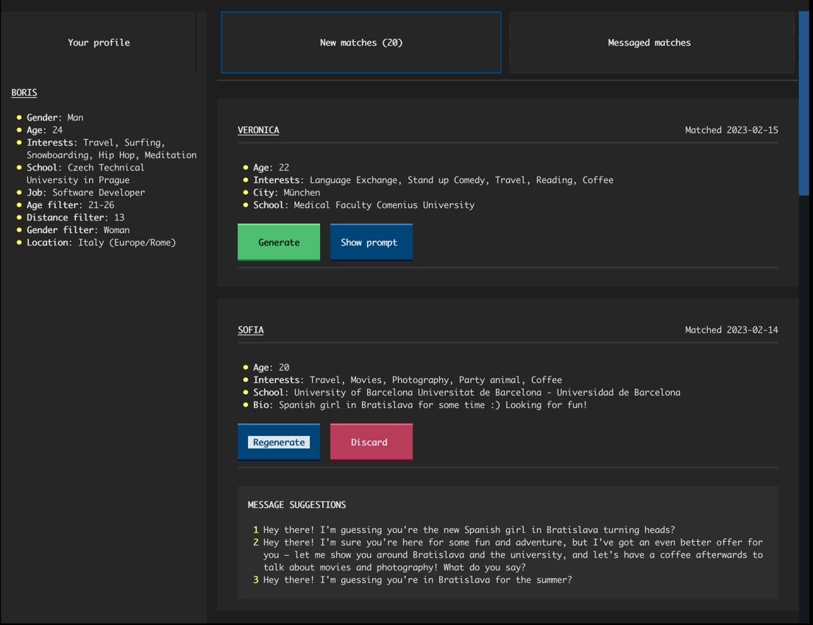
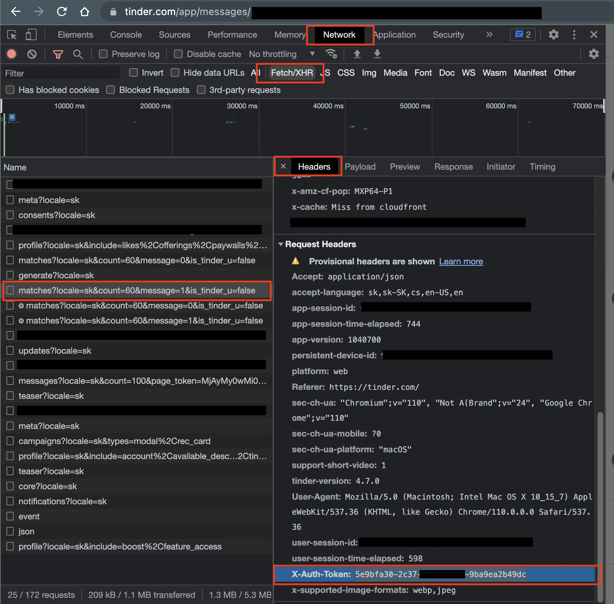

# TinderMate

A GPT-Powered Message Generator for Your Tinder Matches

## About the project

TinderMate is a Python project that harnesses the power OpenAI's [GPT-3 language model](https://en.wikipedia.org/wiki/GPT-3)
and the Tinder API and to streamline the interactions with your matches on the popular dating app. It generates highly suitable pickup lines or message replies
based on your match's profile information, including interests, job, school, and bio, or your message history with the matched person.

The app uses ChatGPT-like language model to generate suitable pickup lines or message replies based on either the matched person’s profile, or your message history with the matched person.

With TinderMate, you can effortlessly:
- Display key details about your matches, such as their name, age, bio, and common interests
- Generate a captivating first message tailored to your match's profile info and shared interests
- Generate a response to the latest message you received from a match
- Customize the auto-generated prompt that prompts the OpenAI GPT model for message generation
- Display the personalized prompt generated based on your match's profile or your mutual message history
- Use a convenient command-line GUI to manage the application

TinderMate is built for both **female and male** users and detects your gender from your Tinder profile, ensuring that your messages are always grammatically correct and effective.
Is also supports **multiple languages** and should automatically infer the most appropriate language for generated messages from language from your match's profile and bio.
However, please note that the GPT-3 model works best with English, and the generated messages might not be as good in other languages.

Make sure to **star the project** if you find it useful! :star:

## Built with

- [Python 3.10](https://www.python.org/)
- [OpenAI GPT3](https://openai.com/blog/openai-api/)
- [Textual](https://github.com/textualize/textual/)
- [Jinja2](https://jinja.palletsprojects.com/en/3.0.x/)

## Requirements

- Python 3.10 or higher
- A Tinder account with valid credentials and a Tinder auth token
- An OpenAI API key 

See the [Installation](#installation) section for more information on how to install the project and its dependencies,
and the [Prerequisites](#prerequisites) section for more information on how to get your Tinder auth token and your OpenAI API key.

## Prerequisites

### Tinder auth token

In order to use the application, you need to have a Tinder account and a Tinder auth token. You can get your auth token
by logging into the [tinder application](https://tinder.com/) in your browser and then using the browser developer tools 
to inspect the network requests made by the application. You should be able to find the auth token in the request headers
of the request made automatically by your browser to the Tinder backend API endpoint (`https://api.gotinder.com/`).
The auth token is a long string of random characters and numbers that is sent in the `X-Auth-Token` header of the request.

The following screenshot shows how you can find the auth token in the request headers of a request made to the Tinder API
in your browser's developer tools:

Note that the authorization token gets periodically invalidated, so you might need to repeat this process every once in a while.
The app will automatically notify you if your auth token is invalid and prompt you to enter a new one.

### OpenAI API key

You also need to have an OpenAI API key in order to call the GPT-3 text completion AI language model.
You can get one by signing up for an account on the [OpenAI website](https://openai.com/) and then creating a new API key.
Depending on your country, you might need to provide your credit card in order to create an API key, although it is possible
that you can get some free credits from OpenAI when you sign up for an account. This whole process should be pretty straightforward.
If you need more information on how to get an API key, you can follow for example
[this tutorial](https://elephas.app/blog/how-to-create-openai-api-keys-cl5c4f21d281431po7k8fgyol0).

I advise you to **set up a usage limit** in your [OpenAI profile configuration](https://platform.openai.com/account/billing/limits),
so you have control over your spending. However, you should not worry about paying too much for the API calls, however, since the OpenAI
pricing model is fairly generous. For instance, I only spent 1$ during the entire initial development of this project, 
making hundreds of API requests to the GPT-3 model.

> Always make sure to check out the [OpenAI pricing page](https://openai.com/api/pricing/) so that you know what you are spending on your API calls.

---

Once you have both your Tinder auth token and your OpenAI API key, you can start using the application. On the first
run, the application will prompt you to enter your both tokens. You can also enter these
credentials manually by creating an empty `.env` file in the application root directory and manually adding the keys
there. See the `.env.example` file for an example of how the `.env` file should look like.

## Installation

1. Make sure you have Python 3.10 or higher installed and available on your `PATH` environment variable
   (You can check your version using `$ python --version`)
2. Clone the repository using `$ git clone https://github.com/borisrakovan/tindermate.git`
3. cd into the directory of the project (e.g. `$ cd tindermate`)
4. *Optional:* Create a virtual environment for the project using `$ python -m venv venv`
and activate it using `$ venv/bin/activate` on Linux/macOS or `$ venv\Scripts\activate` on Windows
5. Install the project's dependencies using `$ python -m pip install .`
6. Run the application in your terminal using `$ python -m main` 

Note: The project is developed using poetry, so you can skip the steps 4 and 5 and use `poetry install` if you have
poetry installed on your system.

## Configuration

*TBD*

## Contributing

Feel free to make a pull request and contribute to this project! If you find any bugs or have any suggestions for new 
features or improvements, please open an issue, and I will try to address it as soon as possible. 

## Disclaimer

TinderMate is an independent project and is **not associated with Tinder or OpenAI in any way**.
It is a personal project that I built for fun and to learn more about the OpenAI's GPT-3 model and the Textual TUI framework. 
The application is intended for **personal use only** and comes with no guarantees or warranties. 
By using TinderMate, you agree that you are responsible for any consequences that may arise from using the application,
and that the application owner and developer cannot be held responsible for any damages or negative outcomes.

Please use TinderMate responsibly and do not rely solely on the generated messages to start or maintain conversations with your Tinder matches.
The app is merely intended to be a helper tool, not a replacement for authentic conversation. **Authenticity and originality** are
essential for building genuine connections with other people. It is also important to note that the generated messages 
are just suggestions, and you are free to modify them to suit your style and personality. Additionally, do not use TinderMate 
to generate inappropriate or offensive messages, as this can result in your account being banned by Tinder. 
By using TinderMate, you acknowledge and agree to the above disclaimer and warnings.

> **Note:** TinderMate is not a Tinder bot, and it does not automate any of the Tinder app's functionality. It can merely
> give you a power to find better words to start or continue a conversation with your Tinder matches. 
> It is not intended to be used for any other purpose than that.
> Additionally, all the communication between the Tinder API and you PC happens in real-time and the app does not store
> any personal data from Tinder on your computer.

---

Good luck finding your future husband/wife :heart:
